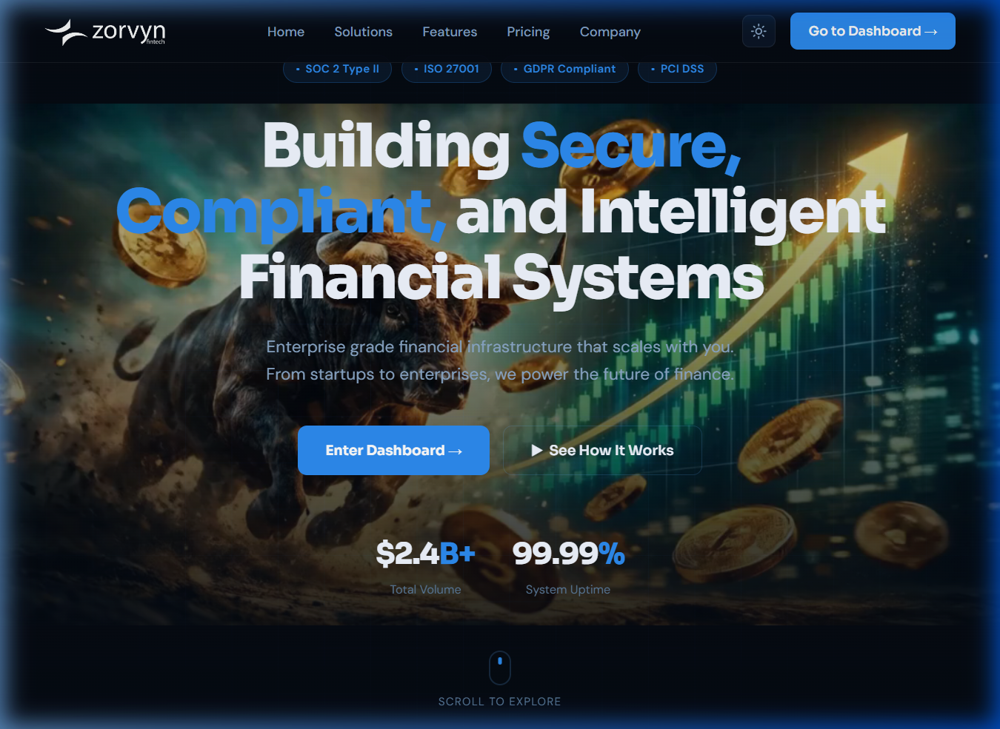
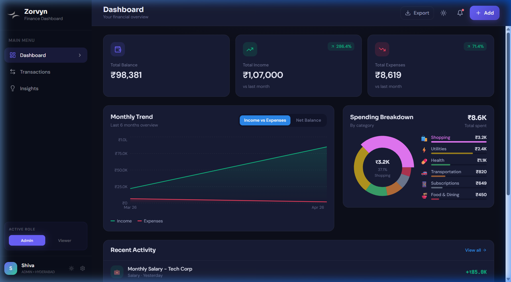
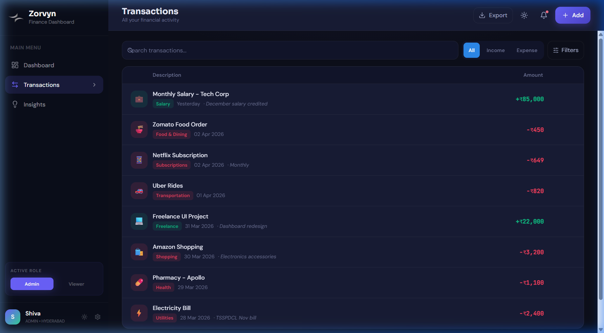
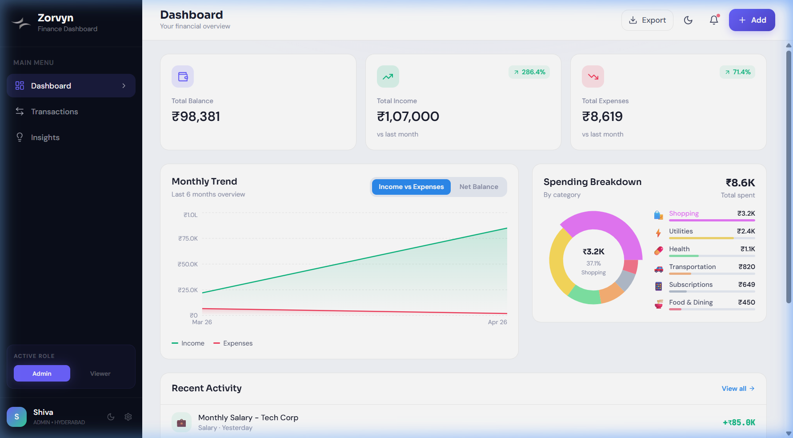
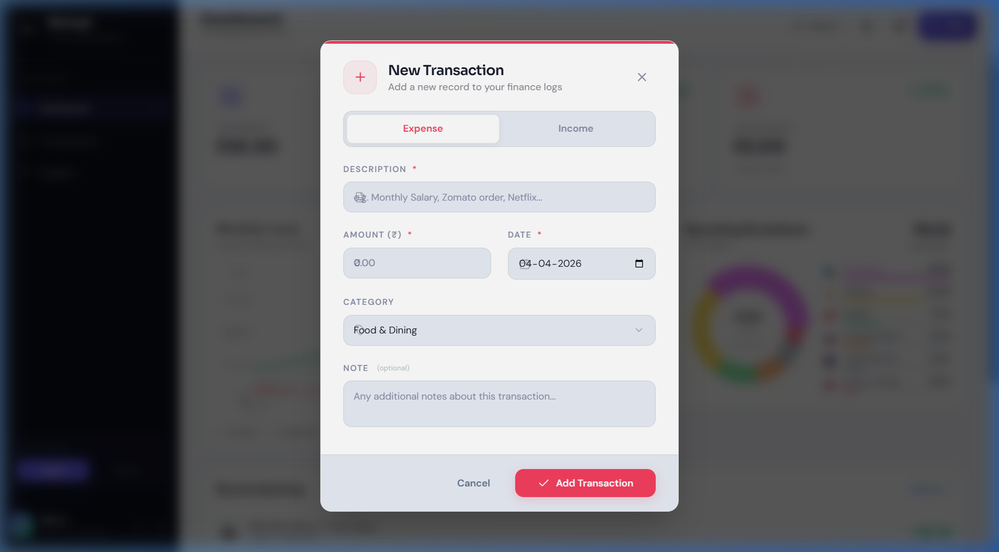

<p align="center">
  
</p>

<h1 align="center">Zorvyn Financial Dashboard</h1>

<p align="center">
  <strong>Enterprise-Grade Personal Finance Management System</strong><br/>
  <em>A full-stack, production-ready dashboard built with scalability, performance, and premium UX in mind.</em>
</p>

<p align="center">
  
  
  
  
  
  
  
  
  
</p>

---

## 📸 Application Screenshots

### 🏠 Landing Page — Scrollytelling Experience
> Apple-inspired scroll-linked canvas animation with a 152-frame image sequence, compliance badges, and a premium hero section.



---

### 📊 Dashboard — Dark Mode (Default)
> Real-time financial overview with Summary Cards, Monthly Trend charts (Recharts), Spending Breakdown donut chart, and Recent Activity feed.



---

### 💳 Transactions — Full CRUD Management
> Searchable, filterable transaction list with category badges, income/expense color coding, and inline edit/delete actions.



---

### ☀️ Dashboard — Light Mode
> Persistent dark/light mode toggle with smooth CSS variable transitions across the entire application.



---

### ➕ New Transaction Modal
> Professional modal with Expense/Income toggle, validated form fields, category dropdown, optional notes, and smooth Framer Motion entry/exit animations.



---

## 🎬 Live Demo Video

> A complete walkthrough of the application — from landing page scrollytelling to dashboard navigation, transaction CRUD, and theme toggling.

https://github.com/user-attachments/assets/placeholder

> ⬆️ *Upload your screen recording to the GitHub release or embed it here after pushing.*

---

## 🧠 Big Picture — How This Project is Structured

This project follows **enterprise software development principles** used at companies like **Google, Amazon, and Netflix**. It's not just a UI — it's a fully layered application.

### 🏗️ Five Architecture Layers

| # | Layer | What It Does | This Project |
|---|-------|-------------|-------------|
| 1 | **Product** | Defines the problem & features | Personal finance tracking with rich visualizations |
| 2 | **Data** | Stores and manages all information | JSON persistence, RESTful CRUD, Zustand state |
| 3 | **Architecture** | How services communicate | Decoupled monorepo (Frontend ↔ REST API ↔ Backend) |
| 4 | **Infrastructure** | Where it runs | Netlify (Frontend) + Render/Railway (Backend) |
| 5 | **DevOps** | Automated build & deploy | Netlify CI/CD, Git-based workflows |

---

## 🏛️ System Architecture

```
┌──────────────────────────────────────────────────────────────────┐
│                         CLIENT (Browser)                         │
│                                                                  │
│  ┌──────────┐  ┌──────────────┐  ┌───────────┐  ┌────────────┐ │
│  │ Landing  │  │  Dashboard   │  │Transactions│  │  Insights  │ │
│  │ (Three.js│  │  (Recharts)  │  │  (CRUD)    │  │  (Charts)  │ │
│  │  Canvas) │  │              │  │            │  │            │ │
│  └──────────┘  └──────────────┘  └───────────┘  └────────────┘ │
│                         │                                        │
│            ┌────────────┴────────────┐                          │
│            │   Zustand State Store   │ ← Persistent via         │
│            │   (Global State Mgmt)   │   localStorage           │
│            └────────────┬────────────┘                          │
│                         │                                        │
│            ┌────────────┴────────────┐                          │
│            │    API Service Layer    │ ← Centralized fetch()    │
│            │    (services/api.js)    │   abstraction             │
│            └────────────┬────────────┘                          │
└─────────────────────────┼────────────────────────────────────────┘
                          │  HTTP (REST)
                          ▼
┌──────────────────────────────────────────────────────────────────┐
│                     SERVER (Node.js/Express)                     │
│                                                                  │
│  ┌────────────────────────────────────────────────────────────┐  │
│  │                    Express Router                          │  │
│  │  GET    /api/transactions       → Read all                │  │
│  │  POST   /api/transactions       → Create new              │  │
│  │  PUT    /api/transactions/:id   → Update by ID            │  │
│  │  DELETE /api/transactions/:id   → Delete by ID            │  │
│  └───────────────────────┬────────────────────────────────────┘  │
│                          │                                       │
│              ┌───────────┴───────────┐                          │
│              │  File System (fs/     │                          │
│              │  promises) — JSON DB  │                          │
│              │  data/transactions.   │                          │
│              │  json                 │                          │
│              └───────────────────────┘                          │
└──────────────────────────────────────────────────────────────────┘
```

---

## 📊 Data Flow Diagrams

### ➕ Add Transaction Flow
```
User fills form → Modal validates → Zustand dispatches addTransaction()
    → api.js POST /api/transactions → Express handler
        → readData() from JSON → push new entry → writeData()
            → 201 Created → Response to frontend
                → Zustand prepends to state → UI re-renders
```

### 🔄 Dashboard Load Flow
```
App mounts → useEffect triggers fetchTransactions()
    → Zustand sets isLoading: true
        → api.js GET /api/transactions → Express handler
            → readData() → sort by date desc → respond
                → Zustand sets transactions[] + isLoading: false
                    → SummaryCards, BalanceTrend, SpendingBreakdown re-render
```

### 🌙 Theme Toggle Flow
```
User clicks toggle → Zustand toggleDarkMode()
    → Updates darkMode state → Persists to localStorage
        → document.documentElement.classList.add/remove('dark')
            → CSS variables cascade → Entire UI re-paints
```

---

## ✨ Key Features

| Feature | Description |
|---------|-------------|
| 🖥️ **Scrollytelling Landing** | Apple-inspired 152-frame canvas animation with scroll-linked interpolation via Three.js & Framer Motion |
| 📊 **Interactive Dashboard** | Area charts (income vs expenses, net balance), donut chart (spending by category), animated summary cards |
| 💳 **Full CRUD Transactions** | Add, Edit, Delete with real-time API persistence and optimistic UI updates |
| 🔍 **Advanced Filtering** | Search by description/category/note, filter by type (income/expense), sort by date/amount/category |
| 🌙 **Dark/Light Mode** | Persistent theme toggle with smooth CSS variable transitions. Preference saved in localStorage |
| 👤 **Role-Based Views** | Admin (full CRUD) vs Viewer (read-only) role switching with conditional UI rendering |
| 📱 **Fully Responsive** | Adaptive layouts for mobile, tablet, and desktop via Tailwind responsive utilities |
| ⚡ **60fps Animations** | Page transitions, modal entry/exit, hover effects, and card animations via Framer Motion |
| 📈 **Real-Time Analytics** | Trend analysis with percentage change indicators (vs last month) |
| 🔔 **Notification System** | Notification bell with badge counter in the header |

---

## 🛠️ Technology Stack

### Frontend

| Technology | Purpose |
|-----------|---------|
| **React 18** | Component-based UI with hooks and concurrent features |
| **Vite 5** | Lightning-fast HMR, build tooling, and dev server |
| **Tailwind CSS 3** | Utility-first styling with dark mode and responsive design |
| **Zustand 4** | Lightweight, performant global state management with persistence |
| **Framer Motion 11** | Production-grade animation library for React |
| **Recharts 2** | Composable charting library built on D3 for React |
| **Three.js + R3F** | 3D canvas rendering for landing page scrollytelling |
| **React Router 6** | Client-side routing with nested layout support |
| **Lucide React** | Beautiful, consistent SVG icon set |
| **date-fns** | Lightweight date formatting and manipulation |

### Backend

| Technology | Purpose |
|-----------|---------|
| **Node.js** | JavaScript runtime for server-side logic |
| **Express 4** | Minimal, fast web framework for RESTful APIs |
| **CORS** | Cross-origin resource sharing middleware |
| **dotenv** | Environment variable management |
| **Nodemon** | Auto-restart dev server on file changes |
| **FS (promises)** | Async file-system persistence (JSON-based DB) |

### DevOps & Tooling

| Technology | Purpose |
|-----------|---------|
| **Concurrently** | Run frontend + backend dev servers in parallel |
| **PostCSS + Autoprefixer** | CSS post-processing for browser compatibility |
| **ESLint** | Code quality and style enforcement |
| **Netlify** | Frontend CI/CD and static hosting |
| **Render / Railway** | Backend hosting for the Express API |

---

## 📁 Project Structure

```
zorvyn-finance-dashboard/
│
├── frontend/                    # React SPA (Presentation Layer)
│   ├── public/
│   │   ├── zorvyn-logo.png     # Brand logo
│   │   ├── favicon.png         # Browser tab icon
│   │   └── sequence/           # 152 frames for canvas animation
│   ├── src/
│   │   ├── components/
│   │   │   ├── layout/
│   │   │   │   ├── Header.jsx       # Top bar: search, export, theme, add
│   │   │   │   └── Sidebar.jsx      # Navigation + role switcher
│   │   │   ├── dashboard/
│   │   │   │   ├── SummaryCards.jsx      # Balance, Income, Expenses
│   │   │   │   ├── BalanceTrend.jsx      # Area chart (Recharts)
│   │   │   │   ├── SpendingBreakdown.jsx # Donut chart
│   │   │   │   └── RecentTransactions.jsx# Latest 5 transactions
│   │   │   ├── transactions/
│   │   │   │   ├── TransactionList.jsx   # Full list with filters
│   │   │   │   └── TransactionModal.jsx  # Add/Edit modal form
│   │   │   ├── insights/               # Analytics components
│   │   │   └── ScrollCanvas.jsx        # Three.js scrollytelling
│   │   ├── pages/
│   │   │   ├── Landing.jsx      # Hero + scroll animation
│   │   │   ├── Dashboard.jsx    # Main dashboard layout
│   │   │   ├── Transactions.jsx # Transactions page wrapper
│   │   │   └── Insights.jsx     # Insights page wrapper
│   │   ├── services/
│   │   │   └── api.js           # Centralized fetch abstraction
│   │   ├── store/
│   │   │   └── useStore.js      # Zustand global state + persistence
│   │   ├── constants/           # App-wide constants
│   │   ├── utils/               # Helper functions
│   │   ├── App.jsx              # Root: routing + theme sync
│   │   ├── main.jsx             # Entry point
│   │   └── index.css            # 600+ lines design system
│   ├── netlify.toml             # Deployment config
│   ├── tailwind.config.js       # Tailwind customization
│   ├── vite.config.js           # Vite + API proxy config
│   └── package.json
│
├── backend/                     # Express API (Business Logic Layer)
│   ├── data/
│   │   └── transactions.json   # JSON-based persistent storage
│   ├── index.js                # Express server + routes
│   └── package.json
│
├── docs/
│   └── screenshots/            # README assets
│       ├── 01_landing_page.png
│       ├── 02_dashboard_dark.png
│       ├── 03_transactions.png
│       ├── 04_dashboard_light.png
│       └── 05_transaction_modal.png
│
├── .gitignore                  # Files excluded from version control
├── package.json                # Root monorepo scripts
└── README.md                   # ← You are here
```

---

## 🔧 State Management (Zustand)

The application uses **Zustand** with **persistence middleware** for lightweight but powerful state management:

```javascript
// store/useStore.js — Key state slices
{
  transactions: [],        // Fetched from API
  isLoading: false,        // Loading indicator
  error: null,             // Error state
  role: 'admin',           // 'admin' | 'viewer' (persisted)
  darkMode: true,          // Theme preference (persisted)
  activeTab: 'dashboard',  // Current navigation tab
  filters: { ... },        // Search, type, category, sort
  modal: { ... },          // Open/close state + mode
}
```

**Why Zustand over Redux?**
- ✅ Zero boilerplate (no actions/reducers/types)
- ✅ Built-in persistence middleware
- ✅ Optimized re-renders out of the box
- ✅ ~1KB bundle size vs Redux's ~7KB

---

## 🌐 API Endpoints

| Method | Endpoint | Description | Status |
|--------|----------|-------------|--------|
| `GET` | `/api/transactions` | Fetch all transactions (sorted by date desc) | `200 OK` |
| `POST` | `/api/transactions` | Create a new transaction | `201 Created` |
| `PUT` | `/api/transactions/:id` | Update a transaction by ID | `200 OK` |
| `DELETE` | `/api/transactions/:id` | Delete a transaction by ID | `200 OK` |

### Example Request — Add Transaction
```json
POST /api/transactions
Content-Type: application/json

{
  "description": "Monthly Salary — Tech Corp",
  "amount": 85000,
  "type": "income",
  "category": "Salary",
  "date": "2026-04-03",
  "note": "December salary credited"
}
```

### Example Response
```json
{
  "id": "t1712345678-a1b2c3d4e",
  "description": "Monthly Salary — Tech Corp",
  "amount": 85000,
  "type": "income",
  "category": "Salary",
  "date": "2026-04-03",
  "note": "December salary credited"
}
```

---

## 🚀 Getting Started

### Prerequisites
- **Node.js** >= 18.x
- **npm** >= 9.x

### 1. Clone the Repository
```bash
git clone https://github.com/shivakarnati2004/shivakarnati2004-zorvyn-financial-dashboard-Assignment.git
cd shivakarnati2004-zorvyn-financial-dashboard-Assignment
```

### 2. Install All Dependencies
```bash
npm run install:all
```
> This installs root, frontend, and backend dependencies in a single command.

### 3. Run Locally (Both Servers)
```bash
npm run dev
```
> This starts **both** the Vite dev server (port 5173) and Express API (port 5000) concurrently.

### 4. Open in Browser
```
Frontend:  http://localhost:5173
Backend:   http://localhost:5000/api/transactions
```

---

## 🌍 Deployment Guide

### Frontend → Netlify

The frontend includes a production-ready `netlify.toml` with:
- ✅ SPA routing (all routes → `index.html`)
- ✅ Security headers (X-Frame-Options, CSP, etc.)
- ✅ Aggressive caching for static assets

**Steps:**
1. Push code to GitHub
2. Connect repo to [Netlify](https://netlify.com)
3. Set **Base directory:** `frontend`
4. Set **Build command:** `npm run build`
5. Set **Publish directory:** `frontend/dist`
6. Deploy 🚀

### Backend → Render

1. Create a new **Web Service** on [Render](https://render.com)
2. Connect your GitHub repo
3. Set **Root Directory:** `backend`
4. Set **Build Command:** `npm install`
5. Set **Start Command:** `node index.js`
6. Add environment variable: `PORT=5000`

---

## 📦 Available Scripts

| Command | Description |
|---------|-------------|
| `npm run dev` | Start both frontend + backend concurrently |
| `npm run dev:client` | Start only the Vite dev server |
| `npm run dev:server` | Start only the Express API server |
| `npm run install:all` | Install all dependencies (root + frontend + backend) |
| `cd frontend && npm run build` | Create production build |
| `cd frontend && npm run preview` | Preview production build locally |

---

## 🔒 Security & Best Practices

- 🔐 **CORS** configured for API security
- 🔐 **Environment variables** via dotenv (not hardcoded)
- 🔐 **X-Frame-Options: DENY** — prevents clickjacking
- 🔐 **X-Content-Type-Options: nosniff** — prevents MIME sniffing
- 🔐 **Referrer-Policy** — controls referrer information
- 🔐 **Input validation** on transaction forms
- 🔐 **Role-based access** — Viewer mode hides CRUD buttons

---

## 📈 Performance Optimizations

- ⚡ **Vite** — sub-second HMR, tree-shaking, code splitting
- ⚡ **Zustand** — ~1KB state management, minimal re-renders
- ⚡ **CSS Variables** — runtime theme switching without re-mount
- ⚡ **Lazy loaded charts** — Recharts renders on viewport entry
- ⚡ **Image sequence preloading** — canvas frames loaded asynchronously
- ⚡ **Aggressive CDN caching** — Netlify headers for static assets (1yr `max-age`)

---

## 🧩 Design Decisions

| Decision | Rationale |
|----------|-----------|
| **Monorepo** | Single repo for frontend + backend simplifies development workflow |
| **JSON Persistence** | Lightweight for this use-case; avoids RDBMS overhead for a portfolio project |
| **Zustand over Redux** | Minimal boilerplate, built-in persistence, and excellent DX |
| **Vite over CRA** | 10-100x faster dev builds, native ESM, better DX |
| **Tailwind + CSS Vars** | Utility-first rapid development + runtime theming |
| **Scrollytelling** | Demonstrates advanced Three.js/Canvas skills for portfolio impact |

---

## 🤝 Contributing

1. Fork the repository
2. Create a feature branch: `git checkout -b feature/amazing-feature`
3. Commit your changes: `git commit -m 'Add amazing feature'`
4. Push to the branch: `git push origin feature/amazing-feature`
5. Open a Pull Request

---

## 📈 A Personal Note for the Team

> *"I have dedicated significant effort to meticulously replicate the Zorvyn website's premium aesthetic. This project represents more than just a completed assignment — it is a demonstration of my commitment to high-quality design and technical excellence. I believe I can contribute even more value to the company and am eager to apply my skills to your larger vision. Thank you for this opportunity."*

---

## 👨‍💻 Author

<p align="center">
  <strong>Shiva Karnati</strong><br/>
  Full-Stack Developer & UI/UX Enthusiast
</p>

| | |
|---|---|
| 📞 **Phone** | [+91-9014266763](tel:+919014266763) |
| 📧 **Email** | [shivakarnati2004@gmail.com](mailto:shivakarnati2004@gmail.com) |
| 🐙 **GitHub** | [shivakarnati2004](https://github.com/shivakarnati2004) |
| 🔗 **LinkedIn** | [shiva-karnati123](https://www.linkedin.com/in/shiva-karnati123) |

---

<p align="center">
  <strong>⭐ Star this repo if you found it impressive!</strong><br/><br/>
  
  <br/><br/>
  © 2026 Shiva Karnati. Developed with Passion for Zorvyn.
</p>
